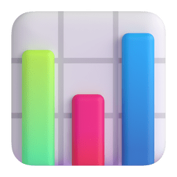

 

  

<!-- Elegant Waving Header -->

  
  
   
  
  

   
   &nbsp;&nbsp;
   &nbsp;&nbsp;
   &nbsp;&nbsp;
   &nbsp;&nbsp;
   &nbsp;&nbsp;
  
    

<!-- Sleek Animated Glowing Line -->

###  About My Journey

> *“Data is the new science. Big Data holds the answers.”* 

<table>
  <tr>
    <td width="65%" valign="top">
      I am a dynamically driven <strong>Statistics Honors Student</strong> at <em>Pabna University of Science and Technology (PUST)</em>. My expertise lies at the intersection of statistical mathematics and programmed data analysis.   
      As a passionate <strong>Data Enthusiast</strong>, I excel in transforming ambiguous, complex datasets into polished, actionable business strategies. I thrive on diving deep into data ecosystems, extracting impactful metrics, and presenting them through seamless visual storytelling.
    </td>
    <td width="35%" align="center">
      
    </td>
  </tr>
</table>

###  Technical Arsenal

 

  
<em>Languages & Core Logic</em>

   &nbsp;&nbsp;&nbsp;
   &nbsp;&nbsp;&nbsp;
  

 

  
<em>Data Manipulation & Visualization</em>

   
   &nbsp;&nbsp;&nbsp;
   &nbsp;&nbsp;&nbsp;
   &nbsp;&nbsp;&nbsp;
   &nbsp;&nbsp;&nbsp;
  

  

  
<em>Workflows & IDEs</em>

   
   &nbsp;&nbsp;&nbsp;
   &nbsp;&nbsp;&nbsp;
  

 

###  Current Endeavors

| | | |
|:---:|:---|:---|
|  | **Studying**  | Full-time <code>B.Sc. Honors in Statistics</code> at PUST |
|  | **Learning**  | Advanced <em>Data Visualization</em> & <em>Predictive Modeling</em> |
|  | **Seeking**   | Collaboration on data science projects and real-world analytical case summaries |

 

### 🏆 Profile Architecture

  

 

  
  &nbsp;&nbsp;
  

<!-- 
Optional Snake Animation: 
Uncomment the below section if you set up the Github Action for the snake animation! 

 

  

-->

 

###  Let's Connect!

  
I am always open to discussing data analytics, statistical modeling, or exciting tech opportunities.  Feel free to reach out to me below!

  
   
   &nbsp;&nbsp;&nbsp;
   &nbsp;&nbsp;&nbsp;
   &nbsp;&nbsp;&nbsp;
  
    
  
  <i><q>In God we trust, all others must bring data.</q> – W. Edwards Deming</i>

<!-- Footer Banner -->

  

